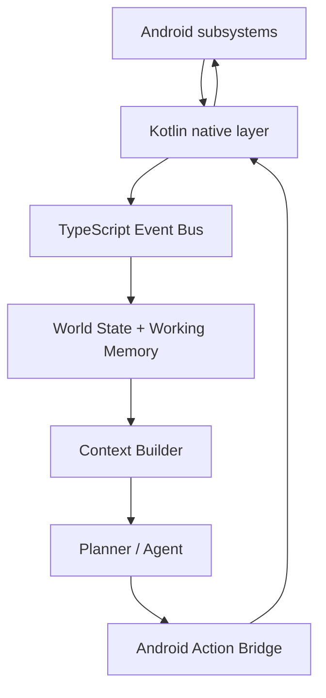

# Jarvis

Jarvis is a sideload-only Android personal AI agent for a phone you own. It observes the device through Android APIs, keeps a current world state, plans actions through a TypeScript Brain, and executes Android actions through a thin Kotlin capability layer.

## Vision

Jarvis is being built as a personal Android operating layer: an agent that can understand the current phone state, operate arbitrary apps through observation and interaction, and later use memory, voice, vision, plugins, and autonomous behaviors without turning the planner into a collection of app-specific automations.

## Architecture



The planner receives semantic context, not raw Android callbacks. Accessibility trees are normalized into screen models before planning.

## Major capabilities

- Embedded TypeScript Brain hosted by the Android app during the current phase.
- Optional laptop Brain mode for Gemini or Anthropic development testing.
- Android Accessibility observation and action execution.
- Notification, SMS, call, battery, Bluetooth, WiFi, clipboard, package, foreground-app, lock, and charging event routing.
- World state, working memory, screen observer, context builder, and event history foundations.
- Floating Jarvis overlay with live task state.
- Local AI Runtime screen for MediaPipe/LiteRT model management and offline tests.

## Repository layout

```text
brain/       TypeScript Brain, planner, event bus, state, task runtime
mobile/      React Native UI plus Android Kotlin capability layer
docs/        Focused documentation for setup, architecture, development, release, and roadmap
```

## Quick start

Start here:

1. [Install prerequisites](docs/getting-started/installation.md)
2. [Run locally](docs/getting-started/running-locally.md)
3. [Review project structure](docs/getting-started/project-structure.md)
4. [Read the architecture overview](docs/architecture/overview.md)

## Documentation index

- [Getting started](docs/getting-started/README.md)
- [Architecture](docs/architecture/README.md)
- [Development](docs/development/debugging.md)
- [Testing](docs/development/testing.md)
- [Build](docs/deployment/build.md)
- [Release](docs/deployment/release.md)
- [Current status](docs/roadmap/current-status.md)
- [Roadmap](docs/roadmap/roadmap.md)
- [Future features](docs/roadmap/future-features.md)

## Current project status

Jarvis is a development prototype, not a production app. The event-driven foundation is implemented and validated on a connected Android device. Long-term memory, wake word, autonomous behaviors, plugin SDK, production release hardening, and a dedicated embedded JavaScript runtime are planned but not complete.

For the detailed status split between implemented, scaffolded, and planned work, see [docs/roadmap/current-status.md](docs/roadmap/current-status.md).
