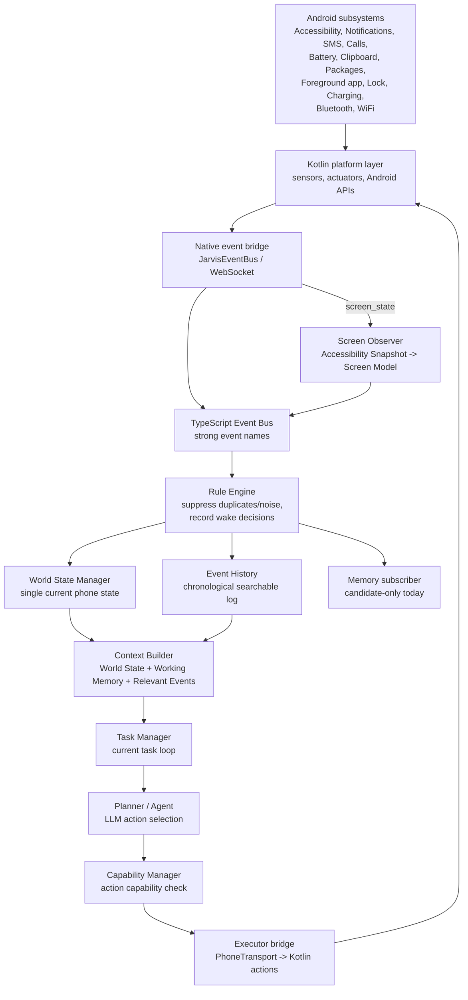
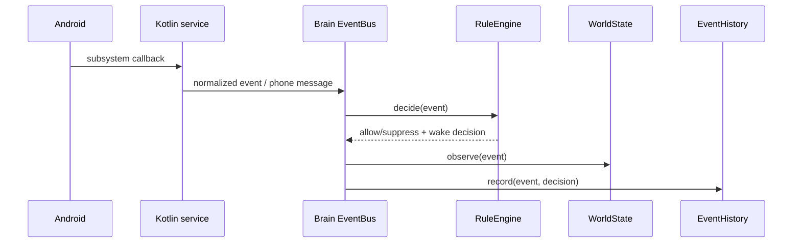
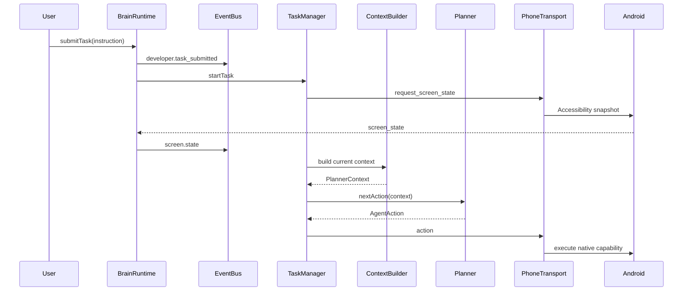

# Jarvis Event-Driven Architecture Validation

Status: Phase 3 event-driven foundation audit  
Scope: validation, cleanup, documentation, and testing only. This document intentionally does not define new feature implementation for Memory Core, Wake Word, Vision, Autonomous Behaviors, Scheduler, or Plugins.

## Architecture scorecard

| Area | Score | Notes |
| --- | ---: | --- |
| Architecture | 7.2 / 10 | Correct event/state direction is in place, but TaskManager is still a one-task loop and CapabilityManager is not yet driven by live permission events. |
| Code quality | 7.0 / 10 | Core TypeScript modules are small and understandable. Mobile controller and Kotlin foreground service are still doing too many jobs. |
| Modularity | 7.5 / 10 | BrainRuntime, PhoneTransport, LlmRuntime, EventBus, WorldState, and ScreenObserver boundaries are good. Plugin/runtime registration needs formal APIs. |
| Observability | 8.0 / 10 | `/health`, developer trace, event history, screen model, world state, and overlay are useful. Context Builder is now exposed through `lastPlannerContext`. |
| Extensibility | 7.0 / 10 | Future event sources can publish normalized events. True plugin SDK and payload schemas are not formalized yet. |
| Plugin readiness | 5.5 / 10 | EventBus can accept new typed events, but there is no plugin registration lifecycle or permission/capability negotiation API. |
| Memory readiness | 7.0 / 10 | Memory can subscribe today through EventBus. Durable storage, embeddings, deduplication, and retrieval are not implemented. |
| Vision readiness | 6.5 / 10 | ScreenModel hides Android Accessibility details, so Vision can later feed the same model. Screenshot capture and merge policy are not implemented. |
| Wake Word readiness | 6.0 / 10 | Event types exist. Audio capture, wake-word service, transcription, and permission UX are not implemented. |
| Autonomous agent readiness | 5.0 / 10 | Observation works, but autonomous policy, safety gates, goal decomposition, scheduling, and background execution semantics are not ready. |
| Production readiness | 4.5 / 10 | Sideload/dev prototype only. Permissions are powerful, logs can contain private data, local Brain host is still React Native-owned. |
| Developer experience | 7.0 / 10 | Windows run docs are clear; Metro/Gradle split is understood. Build path fragility remains painful. |

## Current target architecture



## Execution flow

### Passive observation



### Task execution



## Subsystem audit

### Event Bus

Current files:

- `brain/src/eventBus.ts`
- `brain/src/protocol.ts`
- `mobile/src/JarvisController.ts`
- `mobile/android/app/src/main/java/com/yourname/jarvis/JarvisForegroundService.kt`

Findings:

- Android messages are normalized into Brain events before World State, Working Memory, Event History, or Memory see them.
- Event names are now strongly validated through `JARVIS_EVENT_TYPES`; invalid `android_event.eventType` values are rejected by the protocol schema.
- Event payloads are still generic `Record<string, unknown>`. This is flexible, but not as strong as per-event payload types.
- Future plugins can publish events if they are routed through `EventBus.publish`, but there is not yet a plugin registration API.

Debt:

- Add per-event payload schemas before building a public Plugin SDK.
- Add event-source registration metadata: owner, permission requirements, privacy class, and rate limits.

### Rule Engine

Current file:

- `brain/src/ruleEngine.ts`

Findings:

- Duplicate notification suppression exists.
- Duplicate screen snapshot suppression exists.
- Noisy accessibility screen activity suppression exists.
- Wake decisions are recorded in Event History.
- Rule thresholds are currently hardcoded.

Debt:

- Wake decisions are not a complete autonomous scheduling policy yet.
- Rules should become configurable by event type/source.
- Add metrics counters for suppressed/allowed events by rule.

### World State

Current file:

- `brain/src/worldState.ts`

World State currently tracks:

- current app
- app label
- foreground activity
- screen lock/interactivity
- battery
- charging/power source
- WiFi
- Bluetooth
- clipboard
- last notification
- last SMS
- last call
- last package change
- normalized screen model

Findings:

- Planner can obtain current phone state without replaying history through `brain.getStatus().worldState`.
- ScreenModel is stored in World State and updated from `screen.state`.
- Working Memory duplicates a few transient current fields, but World State is the richer source of truth.

Debt:

- Working Memory and World State both track current app/screen package. This is acceptable for transient task context, but must not drift.
- World State should eventually store source timestamps per field, not one global `updatedAt`.

### Screen Observer

Current file:

- `brain/src/screenObserver.ts`

Pipeline:

```text
Accessibility nodes
-> screen_state
-> ScreenObserver.observe()
-> ScreenModel
-> screen.state event payload
-> WorldState.screen
-> Context Builder
-> Planner
```

Findings:

- Planner prompt no longer receives the raw node tree. It receives `plannerContext.worldState.screen` and only a small `currentScreenState` summary with package/node count/last result.
- ScreenModel hides most Android implementation details, but elements still include Android-ish class names and pixel bounds.
- The ScreenObserver is independent of Kotlin and can later accept Vision-derived snapshots if converted to the same semantic shape.

Debt:

- Improve semantic grouping: list items, tabs, nav bars, forms, dialogs.
- Add stable element IDs or action targets so planner does not need text matching as often.
- Add a privacy redaction layer for notifications/messages before storing screen text in logs.

### Context Builder

Current file:

- `brain/src/contextBuilder.ts`

Findings:

- Planner context is built from task, World State, Working Memory, and relevant recent events.
- Context Builder filters recent events by priority, task/planner/executor types, screen/app events, and task keywords.
- `lastPlannerContext` is exposed in Brain status for validation.

Debt:

- Future relevant memory retrieval is not connected.
- Context compaction is heuristic and not yet token-budget aware.

### Working Memory

Current file:

- `brain/src/workingMemory.ts`

Findings:

- Contains transient state: current task, current task state, foreground app label/package, current screen package, recent events.
- Does not persist across runtime restart.

Debt:

- Keep persistent facts out of this module once Memory Core arrives.
- Consider removing duplicated current app/screen fields once all consumers use World State directly.

### Event History

Current file:

- `brain/src/eventHistory.ts`

Findings:

- Chronological bounded event log exists.
- Search exists through JSON string matching.
- Rule decisions are recorded with events.
- Memory Core already subscribes without EventBus changes.

Debt:

- Need structured indexes by type/source/correlationId/time range for Memory Core.
- Need event privacy classes and retention policy.

### Capability Manager

Current file:

- `brain/src/capabilityManager.ts`

Findings:

- Planner actions are checked against abstract capability IDs.
- Planner does not need to know Android permission names.

Debt:

- All capabilities default to `true`; they are not yet driven by live permission state events.
- Permission denied/granted later is not yet a first-class resume flow.
- Add mapping from setup UI/native permission status into CapabilityManager.

### Kotlin layer

Current files:

- `JarvisForegroundService.kt`
- `JarvisAccessibilityService.kt`
- `DeviceModule.kt`
- `TelephonyModule.kt`
- `SmsReceiver.kt`
- `JarvisNotificationListenerService.kt`
- `JarvisOverlayController.kt`
- `LocalAiRuntimeModule.kt`

Findings:

- Kotlin mostly acts as platform layer: sensors, actuators, Android APIs, foreground service, overlay, local model bridge.
- Kotlin does contain app-resolution scoring and aliases. This is platform-adjacent but partly business logic.
- Kotlin does not run planner reasoning.
- Kotlin executes actions selected by TypeScript.

Debt:

- Move app-resolution policy/aliases toward TypeScript or a shared registry so Kotlin remains thinner.
- Split `JarvisForegroundService.kt`: transport, event publishers, action executor, app resolver, and system receivers are currently in one large file.
- Clipboard event payloads can contain private text; add privacy policy/redaction before persistence.

### Planner

Current files:

- `brain/src/agent.ts`
- `brain/src/taskManager.ts`

Findings:

- Planner receives context, recent history, recent phone events, and current screen summary.
- Planner no longer receives raw Accessibility node arrays in its prompt.
- Planner still receives the `ScreenState` object as a function argument, but `agent.ts` only includes package, node count, last action result, and optional screenshot fields in the LLM request.

Debt:

- `agent.ts` prompt contains app-specific hints and browser task recipe text. Those should move into tools/policies/skills later.
- The task loop is still one-shot task oriented, not a continuous autonomous observe-think-act loop.

### Memory integration

Current file:

- `brain/src/memoryCore.ts`

Findings:

- Memory candidate collector subscribes to events without changing EventBus or planner.
- Planner remains stateless with respect to long-term memory.

Debt:

- No durable storage, embeddings, retrieval, deduplication, or importance model yet.

## Android event publisher coverage

| Subsystem | Current event path | Status |
| --- | --- | --- |
| Accessibility | `screen_state`, `device_observation` -> normalized events | Working |
| Notifications | Notification listener -> `notification.received` | Working |
| SMS | Broadcast receiver -> `sms.received` | Implemented; requires live SMS test |
| Calls | Phone state receiver/call log action -> call events | Implemented; requires live call test |
| Battery | Broadcast receiver -> `battery.changed`, `battery.low` | Working |
| Clipboard | Clipboard listener -> `clipboard.changed` | Implemented |
| Package changes | Package receiver -> install/remove events | Implemented |
| Foreground app | Accessibility window state -> `foreground_app.changed` | Working |
| Screen lock/unlock | Screen/user-present broadcasts -> events | Implemented |
| Charging | Power connected/disconnected -> events | Implemented |
| Bluetooth | Connection state broadcast -> events | Implemented; hardware-dependent test |
| WiFi | Connectivity broadcast -> `wifi.connected/lost` | Working for connection state |

## Device validation notes

Validated on connected device `ZD222TQVPK` / Moto G96 5G.

Confirmed:

- Jarvis launches.
- Metro bundle loads from `localhost:8081`.
- Brain reports connected.
- Permission UI shows event-router readiness rows.
- WhatsApp foreground detection:
  - `worldCurrentApp = com.whatsapp`
  - `screenPackage = com.whatsapp`
  - normalized screen title/buttons present.
- Android Settings foreground detection:
  - `worldCurrentApp = com.android.settings`
  - `screenPackage = com.android.settings`
  - normalized screen title/buttons present.
- Battery and WiFi events appeared in `/health.recentEvents`.
- Notification events appeared in `/health.recentEvents`.

Not fully validated in this pass:

- Live SMS event with a real incoming SMS.
- Live call incoming/missed/ended event.
- Bluetooth connect/disconnect hardware event.
- Package install/remove event through an actual package install/uninstall.
- Screen lock/unlock with post-lock service recovery.
- Long-running task resume after UI recreation.
- Device rotation stress test.

## Biggest risks

1. React Native still owns the embedded Brain host. If the RN JS runtime is killed, long-running Brain logic can die.
2. CapabilityManager is not yet connected to live permission state.
3. Foreground service is doing too many jobs.
4. App-resolution logic is split between TypeScript and Kotlin.
5. Event payloads are not per-event schema typed.
6. Logs and health output can contain private data.
7. Local model planner quality is inconsistent for structured action JSON.
8. Autonomous planning policy does not exist yet.
9. Windows build path split is fragile but currently documented.
10. No durable memory privacy/retention model yet.

## Top 10 improvements ranked by impact

1. Move Brain hosting from RN JS runtime into a service-owned JS runtime after functional architecture stabilizes.
2. Wire native permission/capability events into CapabilityManager.
3. Split `JarvisForegroundService.kt` into event publishers, transport, executor, app resolver, and service lifecycle classes.
4. Add per-event payload schemas and event-source registry.
5. Add privacy redaction classes for logs, health, screen text, notification text, SMS, clipboard.
6. Add context-budgeting and structured relevant memory retrieval in Context Builder.
7. Replace prompt-based app-specific recipes with typed tools/policies.
8. Add continuous loop scheduler with explicit wake policy and safety gates.
9. Add durable Event History storage with retention controls.
10. Create a formal Plugin SDK around event publishers, capabilities, and permissions.

## Readiness recommendations

| Next area | Ready to start? | Recommendation |
| --- | --- | --- |
| Memory Core | Yes, carefully | Start with event subscription, storage, redaction, dedup, retrieval. Do not alter planner first. |
| Wake Word | Not yet | First finish background Brain lifecycle and audio permission UX. |
| Vision | Not yet | Improve ScreenModel semantics first; then add Vision as supplemental ScreenModel source. |
| Goal Manager | Partial | Data scaffold exists, but no decomposition/execution policy. |
| Scheduler | No | Needs autonomous policy, wake/sleep rules, and background lifecycle reliability. |
| Plugin SDK | Not yet | Needs event-source registry and per-event payload schemas. |
| Autonomous Behaviors | No | Needs Goal Manager, Scheduler, safety policy, and capability negotiation. |

## Answers to architecture questions

1. Event Bus architecture is directionally complete but not production complete.
2. Remaining bypasses: dev node-tree tooling, duplicated app resolver paths, direct TaskManager screen-state loop.
3. Planner does not intentionally depend on Android APIs, but prompt contains Android/package hints.
4. Planner prompt does not consume raw Accessibility nodes. Dev tooling and ScreenObserver still do.
5. World State is the intended source of truth; Working Memory duplicates a few transient fields.
6. Working Memory is mostly separated and transient.
7. Event History is sufficient as a foundation, not sufficient for Memory Core production retrieval.
8. Memory Core can subscribe today without EventBus changes.
9. Wake Word can be added as events without planner changes, but service/audio lifecycle is missing.
10. Vision can be added without planner changes if it emits/merges into ScreenModel.
11. Plugins cannot yet register cleanly; they need a formal EventSource/Capability API.
12. Architectural debt: RN-owned Brain lifecycle, coarse payload typing, CapabilityManager not live.
13. Technical debt: large Kotlin service, mixed app resolver logic, Windows build path fragility.
14. Future refactor files: `JarvisForegroundService.kt`, `JarvisController.ts`, `agent.ts`, `capabilityManager.ts`, `screenObserver.ts`.
15. Autonomous continuous planning is blocked by wake policy, safety gates, scheduler, and background Brain runtime.
16. Goal Manager is blocked by decomposition policy and task graph execution.
17. Scheduler is blocked by durable background runtime and policy constraints.
18. Routine Learning is blocked by Memory Core and privacy-safe pattern mining.
19. Knowledge Graph is blocked by durable entity extraction and memory storage.
20. If starting again, define typed event payload schemas, source registry, permission/capability negotiation, and service-owned Brain runtime earlier.
