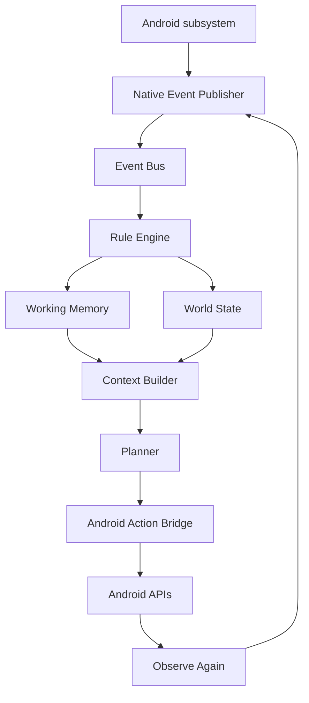

# Execution flow

## Complete runtime



## Passive observation flow

```text
Android callback
-> Kotlin publisher
-> normalized event
-> TypeScript Event Bus
-> Rule Engine
-> World State / Working Memory / Event History
```

Planner does not need to run for every passive event.

## Task flow

```text
Task submitted
-> task.submitted event
-> Task Manager starts task
-> Context Builder prepares planner input
-> Planner selects next action
-> Capability Manager checks requirements
-> Android Action Bridge executes action
-> Android publishes result and new screen state
-> Planner verifies
-> task completed or retry
```

## Example: open an app

```text
User: "Open Calculator"
-> Context Builder includes current app and screen model
-> Planner asks to resolve/open a launchable app matching "Calculator"
-> Android opens the resolved package
-> ForegroundAppChanged and ScreenState events arrive
-> Planner sees currentApp/currentAppLabel and completes
```

This is not a Calculator-specific automation. The same path should work for any launchable app that can be resolved by label/package.

## Example: tap a visible control

```text
User: "Tap 7"
-> Screen Observer exposes visible controls
-> Planner selects find_and_tap targetText="7"
-> Accessibility executes the action
-> Screen state changes
-> Planner verifies and completes
```

## Error flow

```text
Action fails
-> executor.action_result event
-> observe again
-> planner chooses recovery action
-> retry, wait, scroll, go back, ask for permission, or fail clearly
```

Failure should be explicit. Jarvis should not silently pretend a task succeeded.
