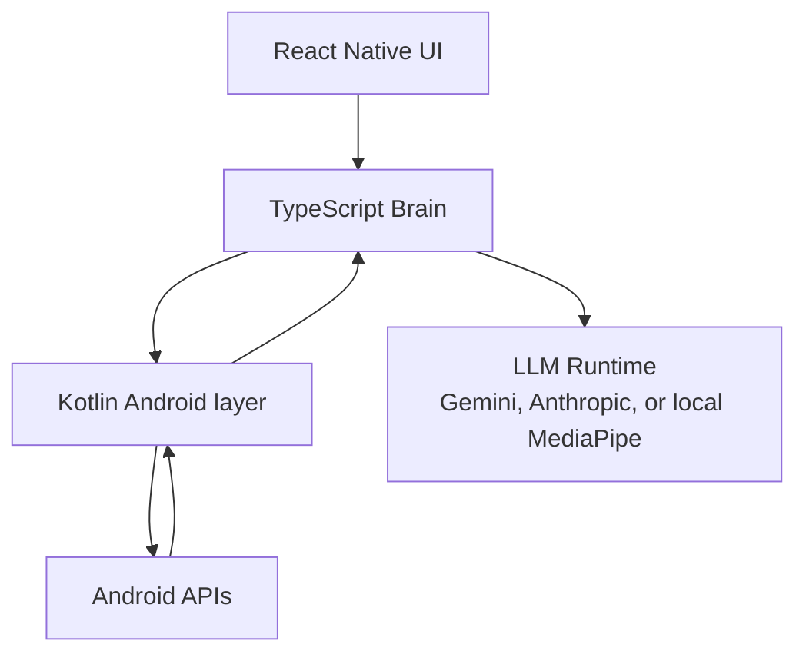
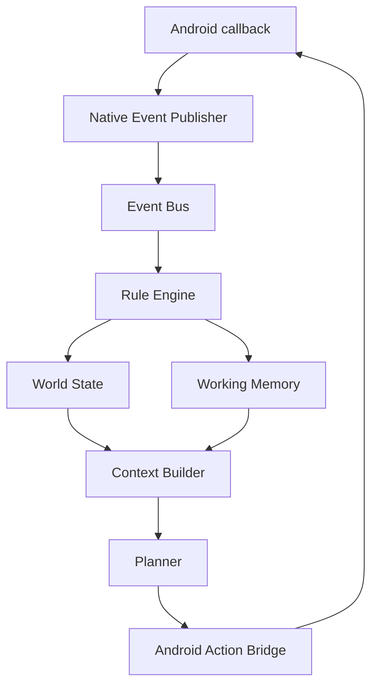

# Architecture overview

## Current runtime shape

The Brain is TypeScript-first. Kotlin provides Android capabilities. React Native is currently both UI and embedded Brain host, but Brain logic is separated behind runtime abstractions so it can later move into a dedicated JavaScript runtime.

## Event-driven direction

## Design principles

- Local-first where possible.
- Planner receives semantic context, not platform internals.
- Android capabilities are exposed through narrow bridge functions.
- Event sources can grow without rewriting the planner.
- App navigation should use current observation, visible text, semantic screen models, and UI state rather than hardcoded app flows.

## Current limitations

- React Native still owns the embedded Brain lifecycle in the current phase.
- Plugin lifecycle and permission negotiation APIs are not formalized.
- Long-term memory is scaffolded, not implemented.
- Wake word, vision, and autonomous behavior policies are planned, not complete.
